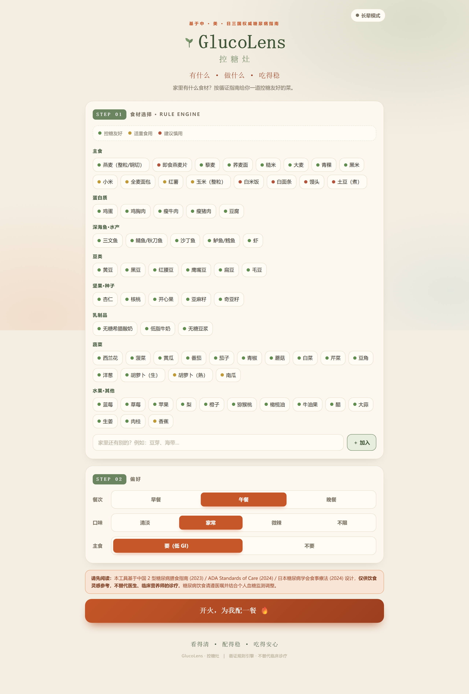
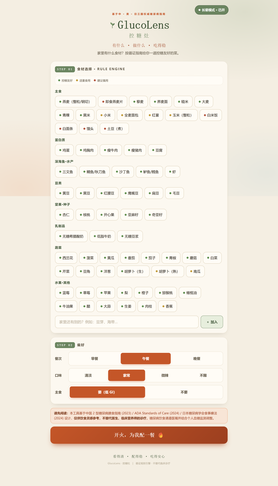
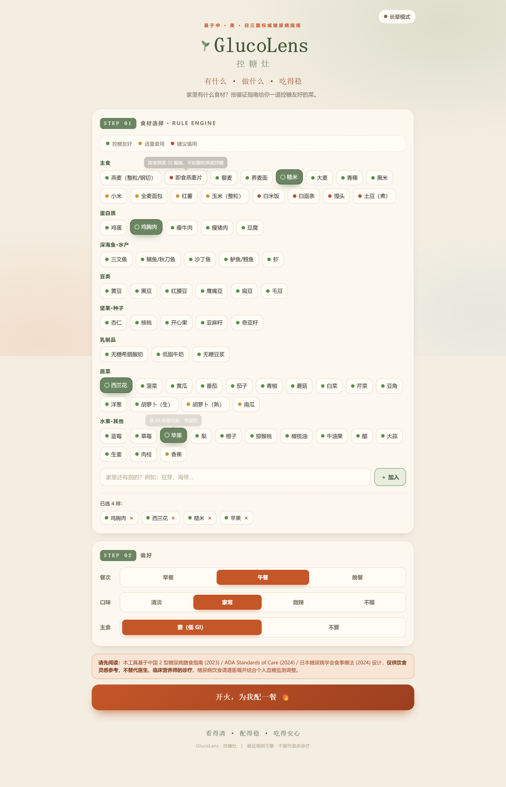
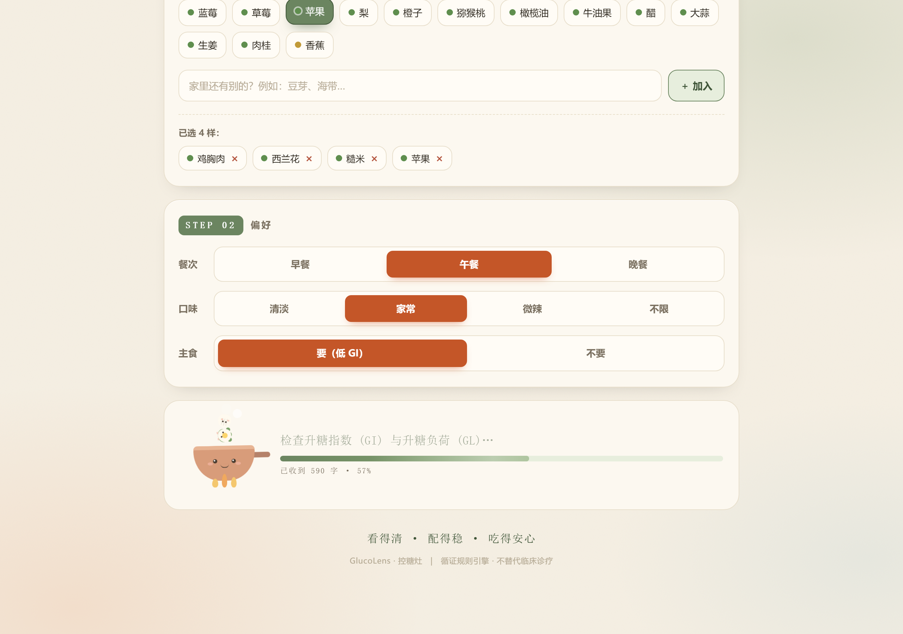
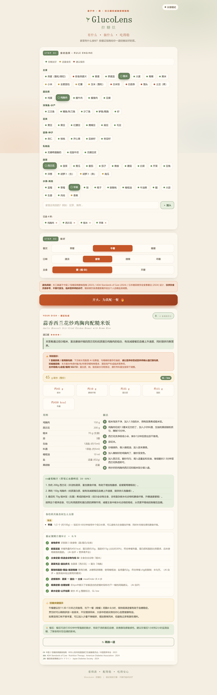
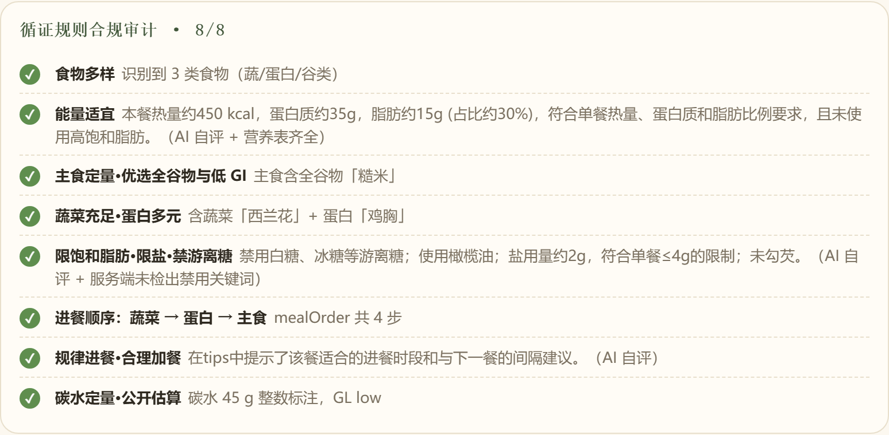
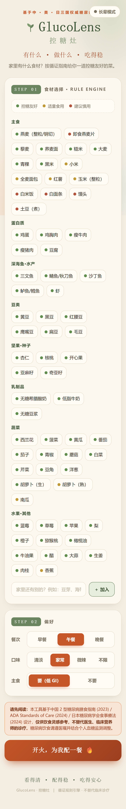

# GlucoLens · 控糖灶

> 基于中 · 美 · 日三国权威糖尿病指南的循证食谱生成器。
> 输入你家中的食材，AI 在 8 条循证硬规则约束内生成一道控糖友好的菜，并给出**规则级合规审计**与明确碳水克数。

> An evidence-based diabetes-friendly recipe generator. Input your available ingredients; AI generates a low-GI dish constrained by 8 hard rules sourced from Chinese, ADA, and Japanese diabetes guidelines, with rule-level compliance audit and explicit carb counts.

**Live**: https://glucolens-xi.vercel.app/
**Status**: 求职作品集 demo / personal project · 不构成医疗建议 · not for clinical use

---

## 界面预览 / Preview

| 默认模式 / Default | 长辈模式 / Senior mode |
|---|---|
|  |  |

| 食材选择 / Ingredient picking | 流式生成 / Streaming loading |
|---|---|
|  |  |

完整食谱卡片 / Full recipe card：



| 规则审计 / Rules audit | 餐伴安排 / Companions |
|---|---|
|  |  |

移动端 / Mobile：



> 截图脚本：`node scripts/screenshots.mjs`（需要 `pnpm add -D playwright && npx playwright install chromium`）

---

## 为什么做这个 / Why

糖尿病饮食决策点遍布每日三餐，但用户痛点其实不是"想不出菜"，而是**"我吃完这餐血糖会到多少 / 我能不能吃这碗面"**。

市面上的"糖尿病食谱"App 普遍存在两个问题：
1. **AI 黑盒分数误导**：给出 "控糖友好度 88 分" 却没有方法论说明，对 T1D 用户的胰岛素剂量决策构成风险。
2. **规则模糊不可审计**：泛泛说"低 GI"、"少糖"，无法定位 AI 是否真的遵守了循证规则。

GlucoLens 的设计思路是：**让 AI 输出可被医生/营养师审计的菜肴方案**。

---

## 技术栈

- Next.js 14 App Router + TypeScript
- Gemini 2.5 Flash（流式调用，关闭 thinking 模式）
- 服务端 SSE → 客户端 NDJSON 流式协议
- in-memory rate limit（Upstash Redis 升级路径已预留）
- next/og 动态 OG image（Edge runtime）
- PWA manifest（可"加到主屏幕"）

部署：Vercel

---

## 三层架构

```
┌─────────────────────────────────────────────────────────┐
│  规则层 RULE ENGINE                                      │
│  • src/data/ingredients.ts  ~50 项食材带 GI + 来源标签   │
│  • src/data/rules.ts        8 条硬规则带 CN/ADA/JDS 引用 │
└────────────────────────────────┬────────────────────────┘
                                 │ 注入 prompt
┌────────────────────────────────▼────────────────────────┐
│  AI 层 LLM CONSTRAINED OUTPUT                            │
│  • src/lib/prompt.ts        prompt 模板 + 强制输出 schema│
│  • src/lib/gemini.ts        流式调用 + 容错归一化        │
│  • src/app/api/recipe       NDJSON 流式 API + rate limit │
└────────────────────────────────┬────────────────────────┘
                                 │ 返回 Recipe + RulesCheck
┌────────────────────────────────▼────────────────────────┐
│  展示层 EVIDENCE AUDIT UI                                │
│  • RecipeCard               明确碳水克数 + 8 条审计      │
│  • SafetyWarning            T1D / 妊娠糖尿病 / 用药警告  │
│  • LoadingScene             实时流式进度 + Jellycat 动画 │
│  • ModeToggle               长辈模式（字号/对比度可切）   │
└─────────────────────────────────────────────────────────┘
```

---

## 关键设计决策

### 1. 用 Gemini 不用 Claude
- 免费额度充足，C 端可承受
- Claude 留给作者写代码（成本最优分工）
- 服务端调用，key 不暴露在浏览器

### 2. 8 条硬规则全部带来源
每条 HARD_RULE 都标注循证来源代码（CN/ADA/JDS），prompt 中以指令形式注入，并要求 AI 在输出中回报 `rulesCheck` 数组逐条 pass/fail + reason。
来源文档置于 `source/`，分别为：

- **CN** 中国 2 型糖尿病膳食指南 2023（国家卫健委 / 中国营养学会）
- **ADA** ADA Standards of Care · Nutrition Therapy 2024
- **JDS** 糖尿病食事療法ガイドライン 2024（日本糖尿病学会）

### 3. 删除 "0-100 控糖友好度" 神秘分数
替换为 **8 条规则透明 checklist**，每条 ✓/✗ + AI 解释。用户和医生都能审计 AI 的判断逻辑。

### 4. carbsGrams 强制整数克
而非 "约 X g" 字符串。给 T1D 用胰岛素剂量参考用，但必须搭配明显的 SafetyWarning（"AI 估算值不替代精确称重"）。

### 5. 关闭 Gemini "thinking" 模式
Gemini 2.5 Flash 默认开启内部推理，导致首 token 等待 23+ 秒。设 `thinkingConfig.thinkingBudget = 0` 后首 token 2.1 秒，总耗时从 30s 降到 8s。

### 6. 流式响应：NDJSON over HTTP
不用打字机式逐字渲染（医疗类老年用户体验差），而是：
- 服务端 SSE 接收 Gemini → 累计字符数 → NDJSON 输出 chunk 事件
- 客户端读取流，更新 "已收到 X 字 / NN%" 进度
- 完成后一次性渲染卡片（避免半截 JSON）

### 7. 默认成人 UI + 可切换长辈模式
糖尿病 ≠ 老年病：T1D 多见儿童青少年，T2D 年轻化，妊娠糖尿病、糖前期都是中青年。把字号/按钮放大做成默认是设计错误，**做成 opt-in toggle**，localStorage 持久化。

---

## Roadmap

- [x] **P1 医学可信度**：规则带来源、食材库修正扩容、删除 friendlyScore、安全警告
- [x] **P2 UX 急救**：流式响应、长辈模式、桌面响应式、SEO/OG/PWA、错误分级
- [x] **P3 上线**：rate limit、demo banner、双语 README、Vercel 部署
- [ ] **P4 账户与数据**：Supabase 接入、个人食谱本、餐后血糖记录
- [ ] **P5 数据闭环 + RAG**：糖尿病指南向量库、个人血糖反应学习、周报

---

## 本地开发

```bash
pnpm install
cp .env.local.example .env.local   # 填入 GEMINI_API_KEY
pnpm dev                            # http://localhost:3000
```

无 API key 也能跑：`/api/recipe` 自动返回 mock 食谱。

---

## 免责声明 / Disclaimer

**本项目仅供工程能力展示与饮食灵感参考，不构成医疗或营养建议，不替代医生、临床营养师的专业诊疗。糖尿病饮食管理请遵医嘱并结合个人血糖监测调整。**

This project is for engineering demonstration and dietary inspiration only. It does not constitute medical or nutritional advice and is not a substitute for clinical care. Always follow your physician's guidance.

---

## License

MIT
